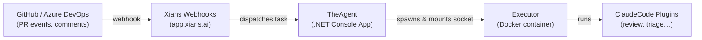

# The Xianix Agent

## Architecture

The system connects your code platform to AI-powered automation through a layered pipeline:



| Layer | What it does |
|---|---|
| **GitHub / Azure DevOps** | Source of events — PR opened, comment posted, etc. |
| **Xians Webhooks** | Receives platform events and routes them to the registered agent. |
| **TheAgent** | Long-running .NET process that polls Xians, interprets tasks, and orchestrates execution. |
| **Executor** | Isolated Docker container spawned per task; has no persistent state. |
| **ClaudeCode Plugins** | Skills (e.g. PR review, post-review) that run inside the Executor and call the LLM. |

---

## Setup

1. Copy `.env.example` to `.env` and fill in all required values:

```bash
cp .env.example .env
```

Key variables to set: `XIANS-SERVER-URL`, `XIANS-API-KEY`, `ANTHROPIC-API-KEY`, and at least one platform token (`GITHUB-TOKEN` or `AZURE-DEVOPS-TOKEN`). See `.env.example` for the full list.

### Environment-specific config

The agent loads its env file based on the `APP_ENV` variable:

| `APP_ENV` | File loaded |
|---|---|
| _(not set)_ | `.env` |
| `prod` | `.env.prod` |
| `production` | `.env.production` |
| `staging` | `.env.staging` |

Any value passed to `APP_ENV` maps to `.env.<value>`, so you can define any environment you need without touching the code.

## Docker Images

The project produces two Docker images, both published to Docker Hub under the `99xio` org.

### Executor

The agent spawns executor containers to run plugins in isolated environments. See [Executor/README.md](Executor/README.md) for full details.

```bash
cd Executor/
docker build -t 99xio/xianix-executor:latest .
```

### TheAgent

The agent itself is also containerised. It requires access to the Docker socket to manage executor containers.

```bash
cd TheAgent/
docker build -t 99xio/xianix-agent:latest .
```

Run locally with Docker socket mounted:

```bash
cd TheAgent/
docker run --rm \
  --env-file .env \
  99xio/xianix-agent:latest
```

### Publishing

Both images are published to Docker Hub automatically when you push a version tag:

```bash
VERSION=v1.0.0
git tag $VERSION
git push origin $VERSION
```

This triggers [publish-executor.yml](.github/workflows/publish-executor.yml) and [publish-theagent.yml](.github/workflows/publish-theagent.yml) in parallel. Tags are derived from the version (e.g. `v1.2.3` produces `1.2.3`, `1.2`, `1`, and `latest`). Pre-release tags (e.g. `v1.0.0-rc1`) skip the `latest` tag. Both workflows can also be triggered manually via `workflow_dispatch`.

### CI Secrets

Both workflows require a `DOCKERHUB_TOKEN` secret in the repository settings (**Settings > Secrets and variables > Actions**).

## Run

From the repo root:

```bash
# Development (loads .env)
dotnet run --project TheAgent/TheAgent.csproj

# Production (loads .env.production)
APP_ENV=production dotnet run --project TheAgent/TheAgent.csproj
```

To use a different `.env` file, set `APP_ENV` to any name — the agent loads `.env.<APP_ENV>` from the `TheAgent/` directory:

```bash
# Loads TheAgent/.env.local
APP_ENV=local dotnet run --project TheAgent/TheAgent.csproj

# Loads TheAgent/.env.alice (useful for per-developer overrides)
APP_ENV=alice dotnet run --project TheAgent/TheAgent.csproj
```

Create the file by copying the example and filling in your values:

```bash
cp TheAgent/.env.example TheAgent/.env.local
```

> The file must live in `TheAgent/` — `EnvConfig.Load` resolves the name relative to the working directory via `DotNetEnv`'s `TraversePath`. Arbitrary file paths are not supported; use `APP_ENV` to switch between files in that folder.

## Tests

```bash
dotnet test TheAgent.Tests/TheAgent.Tests.csproj
```

## Simulating webhooks

Once the agent is running, you can fire simulated GitHub webhook events using the scripts in [`Scripts/`](Scripts/README.md):

```bash
export WEBHOOK_URL=https://app.xians.ai/webhooks/<your-agent-id>
./Scripts/simulate-pr-opened.sh    # should respond { "status": "success" }
./Scripts/simulate-pr-closed.sh    # should respond { "status": "ignored" }
```
